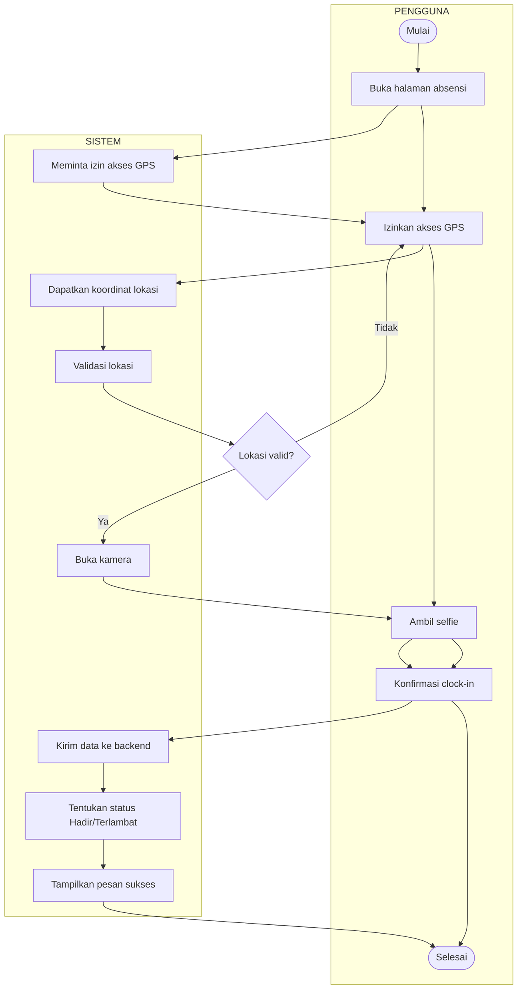

BAB III
ANALISIS DAN PERANCANGAN SISTEM

3.1 Metode Pengembangan Sistem

Metode pengembangan sistem ini menggunakan paradigma pengembangan sistem secara Waterfall, metode model Waterfall mengusulkan sebuah pendekatan kepada perkembangan perangkat lunak yang sistematis dan sekuensial mulai pada tingkat dan kemajuan sistem pada seluruh analisis, desain, kode, pengujian, dan pemeliharaan. Model ini menawarkan cara pembuatan perangkat lunak secara lebih nyata dan terstruktur, yang sangat cocok untuk pengembangan sistem mobile dan backend yang membutuhkan perencanaan yang matang.

Tahapan model ini meliputi:

1. Analisis Kebutuhan Perangkat Lunak

Dalam tahapan ini kendala dan tujuan dihasilkan dari konsultasi dengan pengguna sistem yang kemudian dibuat dalam bentuk yang dapat dimengerti oleh semua pengguna. Untuk proyek SOBM, analisis kebutuhan dilakukan dengan mengidentifikasi kebutuhan operasional gedung, kebutuhan petugas lapangan, supervisor, dan manajemen gedung.

2. Sistem dan Desain Perangkat Lunak

Proses desain sistem membagi kebutuhan-kebutuhan menjadi sistem perangkat lunak atau perangkat keras. Proses tersebut menghasilkan sebuah arsitektur sistem keseluruhan. Desain perangkat lunak termasuk menghasilkan fungsi sistem perangkat lunak dalam bentuk yang mungkin di transportasi ke dalam satu atau lebih program yang dapat dijalankan. Tahapan ini telah menentukan alur software hingga pada tahap algoritma yang detail. Untuk SOBM, desain mencakup arsitektur backend (Laravel) dan frontend (Flutter) dengan integrasi API.

3. Implementasi dan Uji Coba Sistem

Selama tahap ini desain perangkat lunak disadari sebagai sebuah program lengkap atau unit program. Desain yang telah disetujui, diubah dalam bentuk kode-kode program. Pada tahap ini kode-kode program yang telah dihasilkan masih pada tahap modul-modul. Di akhir tahap ini, tiap modul ditesting tanpa diintegrasikan. Implementasi SOBM mencakup pengembangan backend API dan frontend mobile app.

4. Integrasi dan Uji Coba Sistem

Unit program diintegrasi dan diuji menjadi sistem yang lengkap untuk meyakinkan bahwa persyaratan perangkat lunak telah dipenuhi. Setelah uji coba, sistem disampaikan ke konsumen. Integrasi SOBM mencakup testing komunikasi antara mobile app dan backend API, serta testing fitur-fitur seperti absensi GPS, pelaporan, dan notifikasi.

5. Operasi dan Pemeliharaan

Sistem dipasang dan digunakan. Pemeliharaan termasuk pembetulan kesalahan yang tidak ditemukan pada langkah sebelumnya. Perbaikan implementasi unit sistem dan peningkatan jasa sistem sebagai kebutuhan baru ditemukan. Untuk SOBM, pemeliharaan mencakup monitoring server, update aplikasi mobile, dan perbaikan bug yang ditemukan setelah deployment.

Gambar 3.1 Metode Pendekatan Waterfall

3.2 Teknik Pengumpulan Data

3.2.1 Studi Kasus dan Simulasi (Case Study and Simulation)

Karena penelitian ini berupa pengembangan prototype untuk tugas mata kuliah Aplikasi Mobile, maka teknik pengumpulan data dilakukan melalui studi kasus dan simulasi berdasarkan skenario operasional gedung yang realistis. Penelitian tidak dilakukan pada lokasi fisik gedung tertentu, melainkan berdasarkan analisis kebutuhan umum operasional gedung yang dikembangkan menjadi prototype sistem.

Adapun data tersebut diperoleh dengan cara:

a. Analisis Kebutuhan Berdasarkan Studi Literatur

Yaitu analisis terhadap kebutuhan umum operasional gedung berdasarkan literatur, referensi sistem manajemen gedung yang ada, dan best practice dalam industri. Kebutuhan yang diidentifikasi mencakup proses absensi, penjadwalan patroli, pelaporan pekerjaan, manajemen kendala, dan notifikasi real-time.

b. Simulasi Skenario Operasional

Yaitu pembuatan skenario simulasi yang mencerminkan kondisi operasional gedung nyata, termasuk berbagai role (Admin, Petugas Lapangan, Supervisor, dll.), alur proses bisnis, dan permasalahan yang mungkin terjadi. Skenario ini digunakan sebagai dasar perancangan fitur dan testing sistem.

3.2.2 Penelitian Kepustakaan (Library Research)

Yaitu penelitian yang dilakukan untuk pengumpulan data dengan cara membaca buku dan artikel ilmiah untuk mendapatkan bahan tambahan yang bersifat teoritis yang dapat menunjang laporan ini. Penelitian kepustakaan mencakup studi tentang sistem manajemen gedung, pengembangan aplikasi mobile, teknologi GPS dan geofencing, serta framework pengembangan software modern seperti Laravel dan Flutter.

3.2.3 Penelitian Laboratorium (Laboratory Research)

Yaitu penelitian yang dilakukan di laboratorium untuk mengaplikasikan pengembangan sistem dengan menggunakan komputer dan juga mengolah data yang telah dikumpulkan selama melakukan penelitian. Dalam melakukan penelitian ini alat bantu yang digunakan untuk mendukung program ini adalah:

1. Perangkat Lunak (Software)

a. Sistem Operasi : Windows 11

b. Editor Text : Microsoft Word

c. Editor Diagram : Draw.io

d. Editor Desain UI/UX : Canva, Figma

e. Editor Program : Visual Studio Code, Android Studio

f. Database : MySQL

g. Pengelola Database : MySQL Workbench, DBeaver

h. Backend Framework : Laravel 10

i. Mobile Framework : Flutter 3.x

j. Bahasa Pemrograman Backend : PHP

k. Bahasa Pemrograman Mobile : Dart

l. API Testing : Postman

m. Browser : Google Chrome

n. Version Control : Git

2. Perangkat Keras (Hardware)

- Satu Unit laptop dengan spesifikasi minimal Core i5, RAM 16 GB, SSD 512 GB untuk pengembangan
- Smartphone Android untuk testing aplikasi mobile
- Smartphone iOS untuk testing aplikasi mobile (jika tersedia)

3.3 Analisis Sistem

Analisis sistem merupakan tahapan yang dilakukan untuk mempelajari dan memahami skenario sistem operasional gedung yang disimulasikan untuk pengembangan prototype. Analisis ini bertujuan untuk mengidentifikasi alur kerja, menemukan kelemahan yang terdapat pada sistem manual atau semi-digital yang umum digunakan dalam operasional gedung, serta menentukan kebutuhan yang diperlukan dalam pengembangan sistem informasi yang baru. Dengan adanya analisis sistem berdasarkan studi kasus dan simulasi, diharapkan sistem yang akan dibangun dapat memberikan solusi terhadap berbagai permasalahan umum dalam operasional gedung sehingga mampu meningkatkan efektivitas, efisiensi, dan akurasi dalam pengelolaan operasional.

3.3.1 Analisa Sistem Yang Sedang Berjalan (Skenario Simulasi)

Berdasarkan studi literatur dan simulasi skenario operasional gedung yang umum terjadi, diketahui bahwa proses pengelolaan operasional gedung pada banyak organisasi masih dilakukan secara manual atau semi-digital yang belum terintegrasi dengan baik. Dalam skenario simulasi ini, diasumsikan bahwa pencatatan absensi karyawan masih menggunakan buku absen manual atau sistem terpisah tanpa verifikasi lokasi yang akurat. Proses penjadwalan patroli dan tugas harian masih dilakukan menggunakan spreadsheet atau jadwal tertulis yang seringkali tidak update secara real-time.

Pelaporan pekerjaan lapangan masih dilakukan dengan cara konvensional seperti mengisi formulir kertas atau mengirim pesan melalui grup WhatsApp yang tidak terstruktur. Dokumentasi foto kegiatan seringkali tidak terarsip dengan baik, sehingga sulit dilacak kembali jika diperlukan untuk audit atau evaluasi kinerja. Selain itu, pelaporan kendala atau masalah yang ditemukan di lapangan tidak memiliki sistem pelacakan yang baik, sehingga status penyelesaiannya sulit dimonitor secara efektif.

Manajemen cuti dan izin karyawan masih dilakukan secara manual dengan surat fisik atau email yang terpisah, sehingga proses approval memakan waktu dan data riwayat cuti tidak terintegrasi dengan sistem absensi. Hal ini menyebabkan potensi kesalahan dalam penentuan status kehadiran (Hadir, Terlambat, Izin, Sakit, Alpa) yang berdampak pada perhitungan kinerja.

Kurangnya sistem notifikasi real-time juga menjadi kendala, di mana karyawan tidak mendapatkan informasi terkini tentang jadwal tugas, perubahan schedule, atau aktivitas rekan kerja lainnya. Bagi manajemen, minimnya dashboard monitoring menyulitkan pengawasan operasional secara menyeluruh dan pengambilan keputusan yang cepat berdasarkan data terkini.

Sistem yang berjalan saat ini masih sangat bergantung pada proses manual sehingga membutuhkan waktu yang cukup lama dalam pengolahan data. Selain itu, proses pencarian data dan penyusunan laporan juga memerlukan usaha tambahan karena data tersebar pada beberapa file dan dokumen yang berbeda.

3.3.2 Gambaran Sistem Yang Sedang Berjalan (Skenario Simulasi)

Gambaran sistem yang disimulasikan dalam pengelolaan operasional gedung dapat dilihat melalui Aliran Sistem Informasi (ASI) yang menggambarkan alur proses bisnis umum mulai dari absensi karyawan hingga pelaporan dan monitoring operasional. Skenario ini dibuat berdasarkan studi literatur dan best practice industri untuk merepresentasikan kondisi operasional gedung yang umum terjadi.

Dalam skenario simulasi, pada tahap awal, karyawan melakukan absensi dengan menandatangani buku absen manual atau menggunakan sistem terpisah tanpa verifikasi lokasi. Data kehadiran kemudian dicatat oleh admin HR atau supervisor untuk keperluan penggajian. Proses ini diasumsikan rentan terhadap kecurangan karena tidak ada verifikasi bahwa karyawan benar-benar berada di lokasi kerja saat absen.

Penjadwalan patroli dan tugas harian untuk petugas lapangan (Security, Housekeeping, Teknisi) dalam skenario ini dibuat oleh supervisor menggunakan spreadsheet atau jadwal tertulis. Jadwal tersebut didistribusikan secara manual kepada petugas terkait. Perubahan jadwal seringkali tidak dikomunikasikan secara real-time, menyebabkan ketidaksesuaian antara jadwal yang ditentukan dengan pelaksanaan di lapangan.

Gambar 3.2 ASI Lama

Dalam skenario simulasi, petugas lapangan melakukan patroli dan tugas sesuai jadwal yang telah ditentukan. Setelah menyelesaikan tugas, petugas melaporkan pekerjaan melalui formulir kertas atau pesan WhatsApp. Dokumentasi foto kegiatan dikirim secara terpisah dan seringkali tidak terarsip dengan baik. Laporan kendala atau masalah yang ditemukan dilaporkan secara verbal atau melalui pesan tanpa sistem pelacakan status penyelesaian.

Untuk pengajuan cuti atau izin dalam skenario ini, karyawan mengisi formulir manual atau mengirim email kepada atasan. Proses approval dilakukan secara manual dan memakan waktu. Data riwayat cuti tidak terintegrasi dengan sistem absensi, sehingga status kehadiran seringkali tidak akurat.

Data hasil rekapitulasi absensi, pelaporan pekerjaan, dan cuti dalam skenario simulasi digunakan oleh manajemen untuk menyusun laporan operasional. Laporan tersebut selanjutnya disimpan sebagai arsip dan digunakan sebagai sumber informasi mengenai kinerja operasional gedung. Namun, karena data tersebar dan tidak terintegrasi, proses penyusunan laporan memerlukan waktu yang cukup lama dan rentan terhadap kesalahan.

Dengan alur kerja simulasi tersebut, seluruh aktivitas operasional gedung masih memerlukan keterlibatan manusia dalam proses pencatatan, pengolahan data, dan penyusunan laporan sehingga berpotensi menimbulkan berbagai kendala dalam pengelolaan informasi. Skenario ini digunakan sebagai dasar untuk merancang sistem SOBM yang dapat mengatasi permasalahan-permasalahan tersebut.

3.3.3 Kelemahan Sistem Yang Sedang Berjalan

Berdasarkan analisis terhadap sistem yang sedang berjalan, ditemukan beberapa kelemahan yang dapat mempengaruhi kinerja dan kualitas pengelolaan operasional gedung. Adapun kelemahan tersebut antara lain sebagai berikut:

1. Pencatatan absensi karyawan masih menggunakan buku absen manual atau sistem terpisah tanpa verifikasi lokasi, sehingga rentan terhadap kecurangan dan kesalahan pencatatan.
2. Proses absensi manual tidak memiliki verifikasi GPS yang akurat, sehingga sulit memastikan kehadiran karyawan benar-benar di lokasi kerja yang ditentukan.
3. Penjadwalan patroli dan tugas harian masih dilakukan secara manual dengan spreadsheet atau jadwal tertulis yang seringkali tidak update secara real-time.
4. Pelaporan pekerjaan lapangan masih dilakukan dengan cara konvensional seperti formulir kertas atau pesan WhatsApp yang tidak terstruktur dan sulit diarsip.
5. Dokumentasi foto kegiatan tidak terarsip dengan baik, sehingga sulit dilacak kembali untuk audit atau evaluasi kinerja.
6. Pelaporan kendala atau masalah di lapangan tidak memiliki sistem pelacakan yang baik, sehingga status penyelesaiannya sulit dimonitor secara efektif.
7. Manajemen cuti dan izin karyawan masih dilakukan secara manual dengan surat fisik atau email yang terpisah, sehingga proses approval memakan waktu.
8. Data riwayat cuti tidak terintegrasi dengan sistem absensi, menyebabkan potensi kesalahan dalam penentuan status kehadiran.
9. Kurangnya sistem notifikasi real-time menyebabkan karyawan tidak mendapatkan informasi terkini tentang jadwal tugas dan aktivitas rekan kerja.
10. Minimnya dashboard monitoring menyulitkan pengawasan operasional secara menyeluruh dan pengambilan keputusan yang cepat.
11. Data operasional tersebar di berbagai sumber (buku absen, spreadsheet, email, WhatsApp) sehingga sulit diintegrasikan dan dianalisis.
12. Tidak tersedia sistem yang mampu menghasilkan laporan operasional secara otomatis sehingga setiap laporan harus dibuat melalui proses pengolahan data berulang.
13. Tidak tersedianya sistem informasi berbasis mobile yang terintegrasi menyebabkan transparansi informasi terhadap karyawan menjadi rendah dan dapat menurunkan akuntabilitas kinerja.

3.3.4 Usulan Sistem Baru

Untuk mengatasi berbagai kelemahan yang terdapat pada sistem yang sedang berjalan, maka diusulkan pembangunan Sistem Operasional Building Management (SOBM) berbasis mobile. Sistem yang diusulkan dirancang untuk mengintegrasikan seluruh proses operasional gedung ke dalam satu platform yang dapat diakses secara mobile oleh petugas lapangan, supervisor, dan manajemen gedung sesuai dengan hak akses masing-masing.

Pada sistem yang diusulkan, proses absensi dilakukan melalui aplikasi mobile dengan verifikasi GPS dan selfie untuk memastikan keaslian kehadiran. Sistem akan secara otomatis menentukan status kehadiran (Hadir, Terlambat) berdasarkan waktu clock-in terhadap jam kerja yang telah ditentukan. Data absensi tersimpan secara terpusat di database dan dapat diakses kapan saja.

Sistem menyediakan fitur penjadwalan patroli dan tugas harian yang dihasilkan secara otomatis menggunakan algoritma round-robin yang adil. Jadwal dapat diakses oleh petugas lapangan melalui aplikasi mobile dan perubahan jadwal dapat dikomunikasikan secara real-time melalui notifikasi.

Untuk pelaporan pekerjaan, petugas lapangan dapat melaporkan tugas yang telah diselesaikan melalui aplikasi mobile dengan dokumentasi foto yang terarsip secara terstruktur. Sistem juga menyediakan fitur pelaporan kendala dengan status pelacakan (open, in-progress, resolved) sehingga penyelesaian kendala dapat dimonitor secara efektif.

Manajemen cuti dan izin juga diintegrasikan dalam sistem. Karyawan dapat mengajukan cuti atau izin melalui aplikasi mobile, dan supervisor dapat melakukan approval secara real-time. Data riwayat cuti terintegrasi dengan sistem absensi sehingga status kehadiran dapat ditentukan secara akurat.

Sistem yang diusulkan menyediakan fitur notifikasi real-time untuk memberikan informasi terkini kepada karyawan mengenai jadwal tugas, perubahan schedule, aktivitas rekan kerja, dan update status kendala. Bagi manajemen, sistem menyediakan dashboard monitoring yang menampilkan informasi penting secara visual dan mudah dipahami untuk pengawasan operasional secara menyeluruh.

Selain itu, sistem yang diusulkan menyediakan berbagai fitur pelaporan yang dapat menghasilkan laporan absensi, laporan pelaporan pekerjaan, laporan kendala, dan laporan operasional gedung secara otomatis. Dengan adanya fitur tersebut, proses penyusunan laporan menjadi lebih cepat, akurat, dan efisien.

Melalui penerapan Sistem Operasional Building Management (SOBM) berbasis mobile, diharapkan seluruh proses operasional gedung dapat berjalan secara lebih efektif, transparan, dan terintegrasi sehingga mampu meningkatkan kualitas pengelolaan operasional, akuntabilitas kinerja karyawan, serta mendukung pengambilan keputusan oleh manajemen gedung.

3.4 Perancangan Sistem

Perancangan sistem merupakan tahap yang dilakukan untuk menggambarkan bentuk sistem yang akan dibangun berdasarkan hasil analisis kebutuhan yang telah dilakukan sebelumnya. Pada tahap ini dibuat rancangan sistem menggunakan Unified Modeling Language (UML) yang terdiri dari Use Case Diagram dan Activity Diagram. Perancangan ini bertujuan untuk memberikan gambaran mengenai interaksi pengguna dengan sistem serta alur proses yang terjadi pada setiap fitur yang tersedia dalam Sistem Operasional Building Management (SOBM).

3.4.1 Use Case Diagram

Use Case Diagram digunakan untuk menggambarkan hubungan antara aktor dengan sistem yang akan dibangun. Diagram ini menunjukkan fungsi-fungsi yang dapat dijalankan oleh setiap aktor sesuai dengan hak akses yang dimiliki.

Pada Sistem Operasional Building Management (SOBM) terdapat beberapa aktor utama yaitu Admin, Viewer, Petugas Lapangan (Housekeeping, Teknisi, Security), OSB, Resepsionis, BM, dan User. Setiap aktor memiliki hak akses dan tugas yang berbeda sesuai dengan kebutuhan operasional gedung.

Gambar 3.3 Use Case Diagram SOBM

Berdasarkan Use Case Diagram yang telah dirancang:

a. Admin memiliki akses penuh untuk:
- Login ke sistem
- Mengelola data pengguna (CRUD users)
- Mengelola data area dan checkpoint
- Mengelola kategori tugas
- Generate jadwal patroli otomatis
- Melihat seluruh laporan pekerjaan
- Melihat seluruh data absensi
- Mengelola data cuti dan izin
- Mengupdate status kendala
- Melihat dashboard monitoring

b. Viewer memiliki akses read-only untuk:
- Login ke sistem
- Melihat seluruh laporan pekerjaan
- Melihat seluruh data absensi
- Melihat dashboard monitoring

c. Petugas Lapangan (Housekeeping, Teknisi, Security) memiliki akses untuk:
- Login ke sistem
- Melihat jadwal tugas
- Melakukan absensi clock-in dengan GPS dan selfie
- Melakukan absensi clock-out dengan GPS dan selfie
- Melaporkan pekerjaan dengan foto dan lokasi
- Melaporkan kendala
- Melihat riwayat pekerjaan
- Melihat riwayat absensi
- Mengajukan cuti atau izin
- Melihat feed aktivitas rekan kerja
- Menerima notifikasi

d. OSB dan Resepsionis memiliki akses untuk:
- Login ke sistem
- Melakukan absensi clock-in dan clock-out
- Melaporkan pekerjaan (tanpa keterikatan jadwal)
- Melaporkan kendala
- Melihat riwayat pekerjaan
- Melihat riwayat absensi
- Mengajukan cuti atau izin
- Melihat feed aktivitas
- Menerima notifikasi

e. BM (Building Manager) memiliki akses untuk:
- Login ke sistem
- Melakukan absensi
- Melihat seluruh laporan pekerjaan
- Mengupdate status kendala
- Melihat dashboard monitoring
- Menerima notifikasi

f. User memiliki akses terbatas untuk:
- Login ke sistem
- Melihat feed aktivitas
- Menerima notifikasi

3.4.2 Activity Diagram

Activity Diagram digunakan untuk menggambarkan alur aktivitas atau proses bisnis yang terjadi di dalam sistem secara berurutan. Diagram ini menunjukkan interaksi antara pengguna dengan sistem mulai dari proses awal hingga proses selesai, termasuk pengambilan keputusan yang terjadi pada setiap aktivitas. Dengan adanya Activity Diagram, alur kerja sistem dapat dipahami dengan lebih mudah sehingga memudahkan proses pengembangan maupun implementasi sistem yang akan dibangun.

Pada Sistem Operasional Building Management (SOBM), Activity Diagram digunakan untuk menggambarkan beberapa proses utama yang terdapat dalam sistem, yaitu proses login, proses absensi, proses pelaporan pekerjaan, proses pelaporan kendala, dan proses pengajuan cuti. Setiap diagram menunjukkan langkah-langkah yang dilakukan oleh pengguna serta respon yang diberikan oleh sistem terhadap aktivitas tersebut.

Selanjutnya, berikut merupakan Activity Diagram yang digunakan dalam perancangan Sistem Operasional Building Management (SOBM).

1. Activity Diagram Login

Activity Diagram Login menggambarkan proses autentikasi pengguna saat akan mengakses sistem. Proses ini dilakukan untuk memastikan bahwa pengguna yang masuk ke dalam sistem merupakan pengguna yang memiliki hak akses yang sah.

Gambar 3.4 Activity Diagram Login

Alur proses login:
- Pengguna membuka aplikasi mobile
- Pengguna memasukkan employee_id dan password
- Sistem memvalidasi kredensial
- Jika valid, sistem mengecek role pengguna
- Sistem menampilkan dashboard sesuai role
- Jika tidak valid, sistem menampilkan pesan error

2. Activity Diagram Absensi (Clock-In)

Activity Diagram Absensi menggambarkan proses clock-in karyawan dengan verifikasi GPS dan selfie.

Gambar 3.5 Activity Diagram Absensi Clock-In

Alur proses clock-in:
- Pengguna membuka halaman absensi
- Sistem meminta izin akses GPS
- Pengguna mengizinkan akses GPS
- Sistem mendapatkan koordinat lokasi pengguna
- Sistem validasi lokasi (apakah dalam radius kantor)
- Jika lokasi valid, sistem membuka kamera untuk selfie
- Pengguna mengambil selfie
- Pengguna mengkonfirmasi clock-in
- Sistem mengirim data ke backend
- Sistem menentukan status (Hadir/Terlambat) berdasarkan waktu
- Sistem menampilkan pesan sukses

3. Activity Diagram Pelaporan Pekerjaan

Activity Diagram Pelaporan Pekerjaan menggambarkan proses pelaporan tugas yang telah diselesaikan oleh petugas lapangan.

Gambar 3.6 Activity Diagram Pelaporan Pekerjaan

Alur proses pelaporan pekerjaan:
- Pengguna membuka halaman laporan pekerjaan
- Pengguna memilih jadwal tugas (untuk role petugas lapangan)
- Sistem meminta izin akses GPS
- Sistem validasi lokasi (apakah dalam radius checkpoint)
- Jika lokasi valid, pengguna mengambil foto dokumentasi
- Pengguna mengisi deskripsi pekerjaan
- Pengguna memilih kondisi (Aman/Bersih atau Ada Kendala)
- Jika ada kendala, pengguna mengisi deskripsi kendala
- Pengguna mengirim laporan
- Sistem menyimpan data dan foto
- Sistem menampilkan pesan sukses

4. Activity Diagram Pengajuan Cuti

Activity Diagram Pengajuan Cuti menggambarkan proses pengajuan cuti atau izin oleh karyawan.

Gambar 3.7 Activity Diagram Pengajuan Cuti

Alur proses pengajuan cuti:
- Pengguna membuka halaman pengajuan cuti
- Pengguna memilih tanggal cuti
- Pengguna memilih jenis cuti (cuti, izin, sakit)
- Pengguna mengunggah lampiran (surat izin/sakit)
- Pengguna mengirim pengajuan
- Sistem menyimpan data pengajuan
- Supervisor menerima notifikasi pengajuan
- Supervisor mereview pengajuan
- Supervisor menyetujui atau menolak pengajuan
- Sistem mengupdate status pengajuan
- Pengguna menerima notifikasi status
- Jika disetujui, sistem mengecualikan user dari jadwal pada tanggal tersebut
