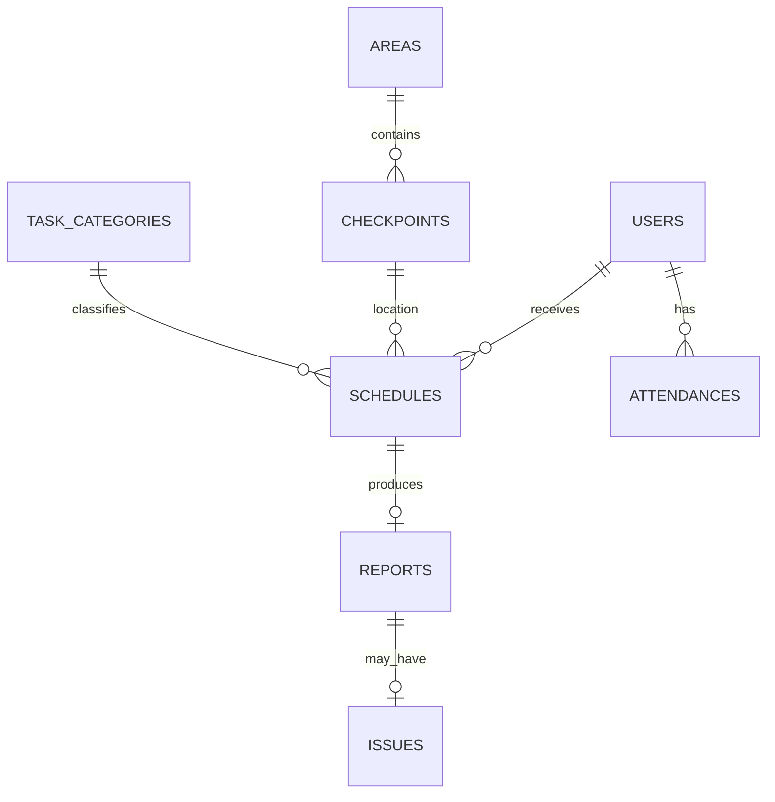

# SOBM - Task dan Dokumentasi Proyek

## Ringkasan

SOBM adalah aplikasi monitoring operasional berbasis lokasi untuk pekerja
lapangan. Pekerja dapat melihat jadwal, melakukan absensi, check-in pada
checkpoint, mengunggah foto kondisi lokasi, mengirim laporan, serta melihat
aktivitas rekan kerja melalui feed aktivitas bersama.

Komponen proyek:

- Backend: Laravel 13, PHP 8.3, Sanctum, dan Filament.
- Frontend: Flutter untuk aplikasi mobile pekerja.
- Database: users, areas, checkpoints, task_categories, schedules, reports,
  issues, dan attendances.

## Aktor

| Aktor | Akses utama |
| --- | --- |
| Admin | Mengelola data operasional dan memantau laporan, aktivitas, issue, serta absensi melalui Filament. |
| Viewer | Melihat data admin sesuai policy yang berlaku. |
| Housekeeping | Melihat jadwal, absensi, mengirim laporan, dan melihat aktivitas rekan. |
| Teknisi | Melihat jadwal, absensi, mengirim laporan, dan melihat aktivitas rekan. |
| Security | Melihat jadwal, absensi, mengirim laporan, dan melihat aktivitas rekan. |

## Alur Utama

1. Admin menyiapkan user, area, checkpoint, kategori tugas, dan jadwal di
   `/admin`.
2. Pekerja login dengan `employee_id` melalui `POST /api/login`.
3. Pekerja mengambil jadwal miliknya melalui `GET /api/schedules`.
4. Pekerja melakukan absensi masuk sebelum bekerja dan absensi keluar setelah
   selesai bekerja.
5. Pekerja mengirim laporan kondisi melalui `POST /api/reports` dengan lokasi
   dan foto. Jadwal yang berhasil dilaporkan berubah menjadi `completed`.
6. Pekerja dan admin melihat feed aktivitas bersama untuk mengetahui laporan dan
   progres rekan kerja. Feed bersifat baca-saja dan tidak menyediakan komunikasi.
7. Admin memantau laporan, aktivitas, issue, dan absensi melalui Filament.

## API Mobile

Semua endpoint selain login menggunakan header:

```text
Authorization: Bearer <sanctum-token>
```

### Autentikasi

| Method | Endpoint | Keterangan |
| --- | --- | --- |
| POST | `/api/login` | Login dengan `employee_id` dan password. |
| POST | `/api/logout` | Menghapus token aktif. |
| GET | `/api/user` | Mengambil user yang sedang login. |

### Jadwal dan laporan

| Method | Endpoint | Keterangan |
| --- | --- | --- |
| GET | `/api/schedules` | Jadwal milik user yang sedang login. |
| POST | `/api/reports` | Mengirim laporan check-in dengan foto, lokasi, kondisi, dan catatan. |

Laporan memvalidasi kepemilikan jadwal, tanggal, status jadwal, radius
checkpoint, format foto, dan kondisi laporan. Satu jadwal hanya dapat memiliki
satu laporan.

### Feed aktivitas laporan

| Method | Endpoint | Keterangan |
| --- | --- | --- |
| GET | `/api/reports` | Mengambil aktivitas laporan lintas pekerja yang dapat dilihat user aktif. |

Aturan feed:

- Hanya user terautentikasi dengan akses worker yang dapat mengakses endpoint.
- Feed menampilkan laporan, catatan, foto, issue, nama pekerja, dan waktu aktivitas.
- Flutter memuat ulang feed saat halaman dibuka atau disegarkan.
- Tidak ada endpoint, input, atau tombol untuk mengirim pesan.

### Absensi

| Method | Endpoint | Keterangan |
| --- | --- | --- |
| GET | `/api/attendance/today` | Status absensi hari ini. |
| POST | `/api/attendance/clock-in` | Absensi masuk dengan lokasi dan selfie. |
| POST | `/api/attendance/clock-out` | Absensi keluar dengan lokasi dan selfie. |

## Aturan Bisnis

### Jadwal

Command `php artisan schedules:generate` membuat jadwal berdasarkan role dan
waktu kerja:

- Housekeeping: setiap dua jam, 08:00-18:00.
- Teknisi: setiap tiga jam, 08:00-18:00.
- Security: setiap jam, 22:00-05:00.

Pembagian user menggunakan round-robin. Jadwal hanya dapat dilaporkan pada
tanggal yang sesuai dan ketika statusnya masih `pending`.

### Laporan

- Check-in harus berada dalam radius checkpoint.
- Foto menerima jpeg, jpg, png, atau webp dengan ukuran maksimal 2 MB.
- Foto disimpan pada disk `public`.
- Kondisi `Ada Kendala` membuat satu issue terkait laporan.
- Feed dapat menampilkan laporan dari banyak pekerja, tetapi setiap jadwal hanya
   memiliki satu laporan.

### Absensi

- Satu user hanya memiliki satu record absensi per tanggal.
- Clock-in memerlukan lokasi dan selfie.
- Jam standar masuk adalah 08:00 WIB.
- Clock-in setelah 08:15 berstatus `Terlambat`; sampai 08:15 masih `Hadir`.
- Clock-out hanya dapat dilakukan setelah clock-in pada hari yang sama.
- Status yang tersedia: `Hadir`, `Terlambat`, dan `Alpa`.

## Model Data Ringkas



Constraint penting:

- `users.employee_id` unik.
- `reports.schedule_id` unik.
- `attendances` memiliki unique index gabungan `user_id` dan `date`.
- Sanctum menggunakan tabel `personal_access_tokens`.

## Konfigurasi dan Keamanan

- Password hasil seeding dibaca dari `SEEDER_DEFAULT_PASSWORD` pada `.env`.
- Seeder tidak memiliki fallback password yang disimpan di repository.
- Jangan menyimpan secret development atau production di source control.
- Token API menggunakan Laravel Sanctum.
- Policy resource membatasi akses admin, viewer, dan worker.
- Koordinat berasal dari perangkat dan belum memiliki perlindungan anti-spoofing.
- Rate limiting khusus login dan pengiriman laporan masih perlu ditambahkan.

Contoh setup lokal PowerShell:

```powershell
$env:SEEDER_DEFAULT_PASSWORD = '<isi-secret-development>'
php artisan migrate:fresh --seed
```

## Status Implementasi

### Selesai

- Migration dan autentikasi Sanctum.
- Login, logout, user, jadwal, dan pengiriman laporan.
- Validasi geolocation dan pencegahan laporan ganda.
- Policy Filament dasar untuk admin dan viewer.
- Fitur absensi clock-in, clock-out, dan status absensi.
- Feed aktivitas laporan lintas pekerja pada backend dan Flutter.
- Test feature untuk login, role access, laporan, dan geolocation.

### Prioritas berikutnya

- Lengkapi test untuk feed aktivitas, absensi, upload foto, dan akses antar-user.
- Tambahkan polling atau realtime notification untuk aktivitas laporan baru.
- Tambahkan filter tanggal, role, checkpoint, dan status bila dibutuhkan.
- Tambahkan workflow issue, audit penyelesaian, dan notifikasi kendala.
- Pisahkan base URL Flutter dari source code ke konfigurasi environment.
- Tambahkan unique constraint dan transaksi untuk mencegah duplikasi jadwal
  saat proses berjalan bersamaan.
- Evaluasi kebijakan arsip dan soft delete agar histori operasional tidak hilang.

## Validasi Lokal

Backend:

```powershell
cd backend
php artisan test
```

Frontend:

```powershell
cd frontend
flutter pub get
flutter analyze
flutter test
```
