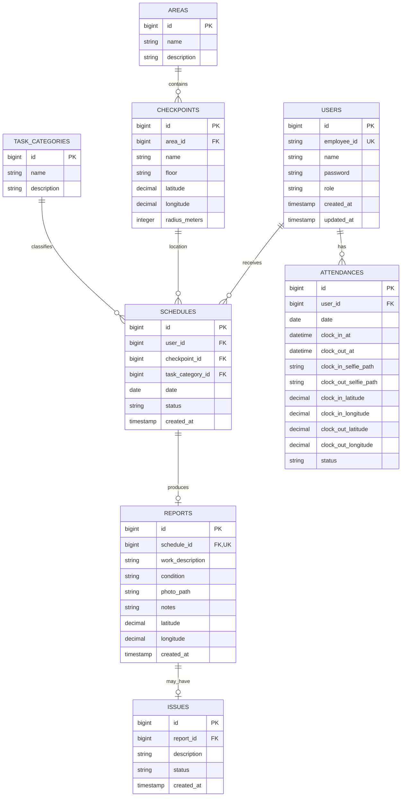

# ERD — SOBM

Dokumen ini menjelaskan struktur entitas, relasi, dan constraint database
SOBM. Kolom yang ditandai **(proposed)** adalah usulan berdasarkan kebutuhan
fitur yang terdokumentasi dan belum tentu sama persis dengan migration final
— cek `database/migrations` di backend sebelum implementasi.

## Diagram Relasi

## Entitas

### `users`

Menyimpan seluruh aktor sistem: Admin, Viewer, Housekeeping, Teknisi,
Security, OSB, Resepsionis, BM, dan **User** (viewer feed aktivitas).

- `employee_id` **unik**, dipakai untuk login (`POST /api/login`).
- `role` menentukan akses mobile, jam kerja, dan apakah punya akun Filament.
- **(proposed)** kolom `role` sebaiknya berupa enum/string yang mencakup
  semua 9 role di atas — role **User**, **OSB**, **Resepsionis**, dan **BM**
  belum ada di skema saat ini dan perlu migration + seeding.

### `areas`

Kelompok lokasi fisik (mis. gedung/lantai/zona) yang menaungi beberapa
`checkpoints`.

### `checkpoints`

Titik lokasi spesifik dalam sebuah area, dengan informasi `floor` yang
ditampilkan ke pekerja, serta koordinat + radius untuk validasi GPS saat
check-in laporan.

- **Gap**: validasi radius berbasis GPS horizontal tidak bisa membedakan
  lantai berbeda pada koordinat yang sama.

### `task_categories`

Kategori tugas yang mengklasifikasikan `schedules` (mis. jenis pekerjaan
housekeeping/teknisi).

### `schedules`

Jadwal kerja per user, dihasilkan oleh `php artisan schedules:generate`
menggunakan pembagian round-robin.

- `status` minimal mencakup `pending` (baru bisa dilaporkan saat status ini)
  dan status setelah dilaporkan.
- Role **OSB** dan **Resepsionis** tetap punya jadwal kerja (jam kerja
  08:00-17:00) tapi **tidak** terikat frekuensi checkpoint tetap, dan laporan
  mereka tidak wajib mereferensikan `schedule_id`.
- Role **Admin**, **BM**, dan **User** tidak menghasilkan baris di tabel ini
  sama sekali (tidak ada jadwal patroli/checkpoint maupun absensi terjadwal
  untuk User).

### `reports`

Laporan pekerjaan dari pekerja.

- `schedule_id` **unik** — satu jadwal maksimal satu laporan. **(proposed)**
  untuk OSB/Resepsionis, kolom ini perlu bersifat **nullable** karena
  `schedule_id` opsional bagi kedua role tersebut.
- `work_description` wajib diisi manual.
- `notes` opsional.
- `photo_path`: jpeg/jpg/png/webp, maksimal 2 MB, disimpan di disk `public`.
- `condition = "Ada Kendala"` memicu pembuatan satu baris `issues` terkait.
- **Gap terbuka**: perlu diputuskan apakah `reports` menyimpan referensi
  langsung ke `checkpoint_id`/`area_id`, atau tetap join berlapis lewat
  `schedules` — penting untuk performa query feed aktivitas, terutama untuk
  laporan OSB/Resepsionis yang tidak selalu punya `schedule_id`.

### `issues`

Dibuat otomatis saat kondisi laporan `Ada Kendala`.

- **Gap**: lifecycle/status (`open`, `in-progress`, `resolved`, dst.) belum
  didefinisikan — saat ini kemungkinan masih flag + deskripsi sederhana.

### `attendances`

Rekam absensi harian per user.

- Unique index gabungan `user_id` + `date`.
- Clock-in & clock-out masing-masing memerlukan lokasi (radius kantor) dan
  selfie.
- `status` ∈ {`Hadir`, `Terlambat`, `Alpa`}, ditentukan dari ambang
  keterlambatan 15 menit terhadap jam masuk role terkait.
- Role **User** tidak pernah punya baris di tabel ini.
- **Gap kritis**: shift Security kedua (20:00-08:00) melewati tengah malam —
  belum jelas apakah `date` merepresentasikan tanggal mulai shift atau
  tanggal kalender saat clock-in/out dilakukan. Perlu keputusan sebelum
  menambah kolom baru atau mengubah constraint unik.

## Constraint yang Sudah Dikonfirmasi

- `users.employee_id` unik.
- `reports.schedule_id` unik.
- `attendances` unique index gabungan (`user_id`, `date`).
- Sanctum menggunakan tabel `personal_access_tokens` (standar package, tidak
  perlu tabel custom).

## Index Tambahan yang Perlu Dievaluasi

- `schedules (user_id, date, status)` — mempercepat query jadwal `pending`
  harian.
- `reports (created_at)` — mempercepat sorting feed aktivitas.
- Pertimbangkan index pada `attendances (date)` bila query rekap harian
  lintas user sering dipakai di Filament.

## Gap Database yang Masih Terbuka

- Struktur penyimpanan foto: kolom path langsung di `reports`/`attendances`
  vs tabel `media` polymorphic terpisah — penting diputuskan sebelum
  dibutuhkan multi-foto per laporan.
- State round-robin (user terakhir yang dapat giliran jadwal) perlu
  disimpan di database (bukan hanya variable runtime di command
  `schedules:generate`) agar konsisten saat command di-restart/di-scale.
- Belum ada soft delete pada `schedules`, `reports`, `attendances` — histori
  operasional bisa hilang kalau data dihapus permanen.
- Skema `users`/`role` dan policy Filament belum mencakup role baru: OSB,
  Resepsionis, BM, dan **User** — perlu migration + seeding sebelum fitur
  terkait role ini dianggap selesai di sisi database.
- Definisi tanggal pada `attendances` untuk shift malam Security masih
  ambigu (lihat bagian `attendances` di atas).
